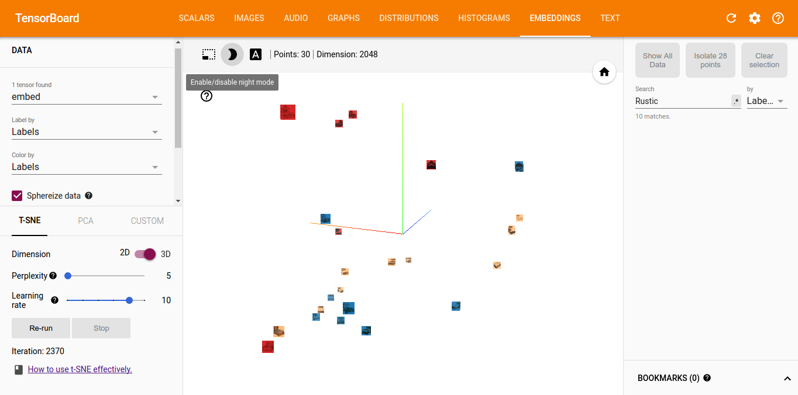

# TensorFlow Embedding Visualization Demo #



https://www.tensorflow.org/get_started/embedding_viz

Use [imagenet model](https://www.tensorflow.org/versions/master/tutorials/image_recognition/index.html#usage-with-python-api) and visualize its outputs.

#### Warning! Python3 required only because of `urllib.request` to download Inception model
```
$ pip3 install --upgrade tensorflow  
$ python3 main.py
$ tensorboard --logdir logdir
```
